# Project 1: LIGHT INTENSITY CHECKER

| **Description** | This is a basic project that helps one to check the light intensity present at a particular environment. |
|------------------|----------------------------------------------------------------|
| **Use case**     |  Wanting to get a device that will measure or detect the brightness of an L.E.D or anything that bright such as day light and even night, you can use this approach to do that. |

## Components (Things You will need)

|  |  |  |  ||
|-------------------------|-------------------------|-------------------------|-------------------------|-------------------------|

## Building the circuit

Things Needed:
-	Arduino Uno = 1
-	Arduino USB cable = 1
-	Light dependent resistor   = 1
-	Red jumper wire = 1
-	Black jumper wire = 1
-	Green jumper wire = 1
-	White jumper wire = 1


## Mounting the component on the breadboard

**Step 1:** Take the light dependent resistor and the breadboard, insert the light dependent resistor into the horizontal connectors on the   breadboard

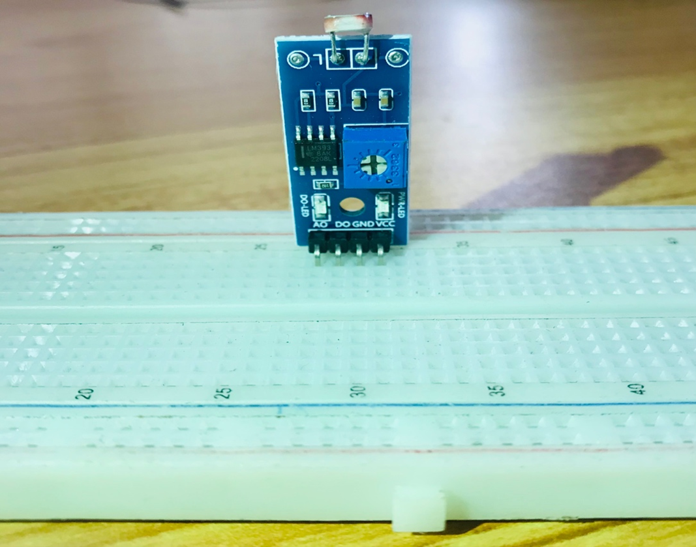.


## WIRING THE CIRCUIT

### Things Needed:

- Red male-male-to-male jumper wires = 1
- Blue male-to-male jumper wires = 1


**Step 2:** Take the red jumper wire. Connect one end of the wire to the “VCC” port on the resistor and the other end to the “5V” port on the Arduino UNO.

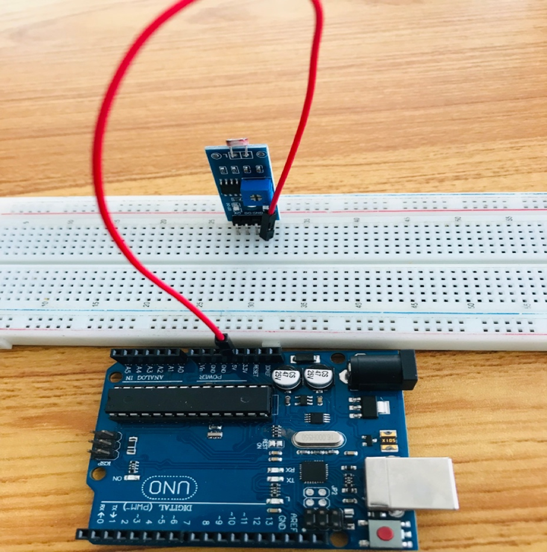

**Step 3:** Take the black jumper wire. Connect one end of the wire to the “GND” hole on the Arduino UNO and the other end to the “GND” port on the resistor.

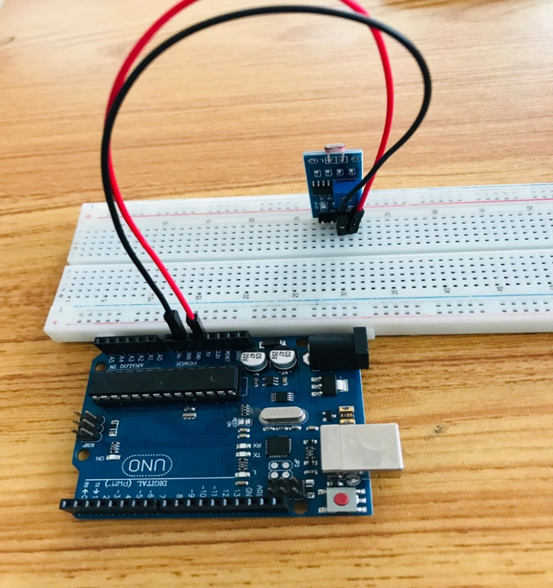.

**Step 4:** Take the white jumper wire. Connect one end of the wire to the “DO” hole on the resistor and the other end to hole number 2 on the Arduino UNO.

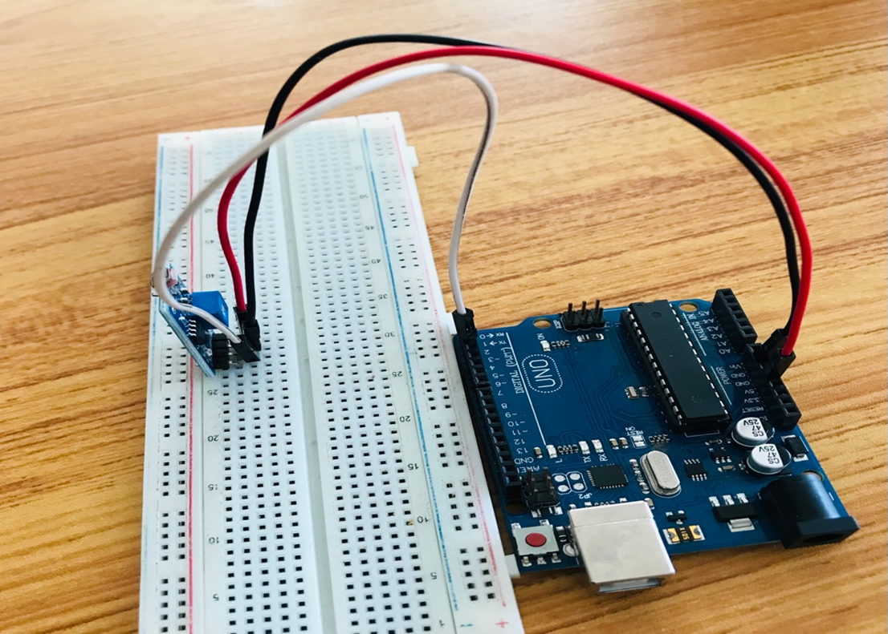.

**Step 5:** Take the green jumper wire. Connect one end of the wire to the “AO” port  on the Arduino UNO to the “AO” port on the resistor.

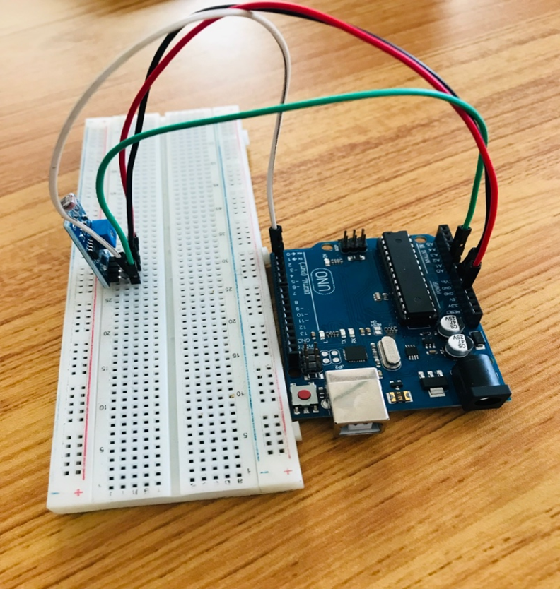.

_make sure you connect the arduino usb use blue cable to the Arduino board_.

## PROGRAMMING

**Step 1:** Open your Arduino IDE. See how to set up here: [Getting Started](../../../../README.md#getting-started).

**Step 2:** Type ``` const int LDR_PIN = A0; ``` as shown below in the image.

_**NB:** Make sure you avoid errors when typing. Do not omit any character or symbol especially the bracket { }  and semicolons ;  and place them as you see in the image . The code that comes after the two ash backslashes “//” are called comments. They are not part of the code that will be run, they only explain the lines of code. You can avoid typing them._
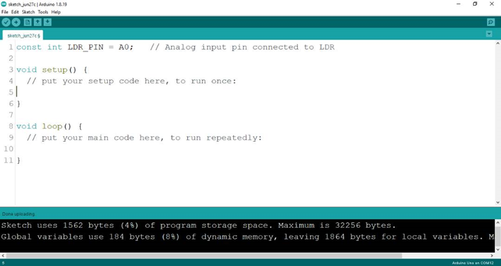.

**Step 3:** Type ``` const int DO_PIN = 2;``` as shown below in the image.

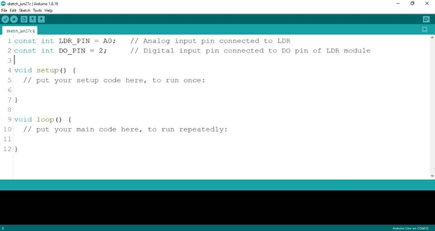.
_**NB:** The code below sets the pin names as an output pin. An output pin helps send signals from the microcontroller to other components in the circuit. The pinMode () function, helps determine and control the behavior of a specific pin on the board._

**Step 4:** Type ``` pinMode (DO_PIN, INPUT); ``` as shown below in the image.

.

**Step 5:** Type ``` Serial.begin(9600); ;``` as shown below in the image.

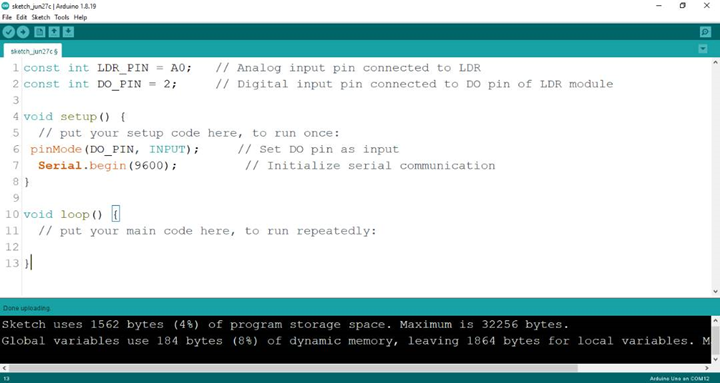.

**Step 6:** Type ``` int 1drValue = analogRead (LDR_PIN); ``` as shown below in the image.

.

**Step 7:** Type ``` int digitalValue = digitalRead (DO_PIN); ``` as shown below in the image.

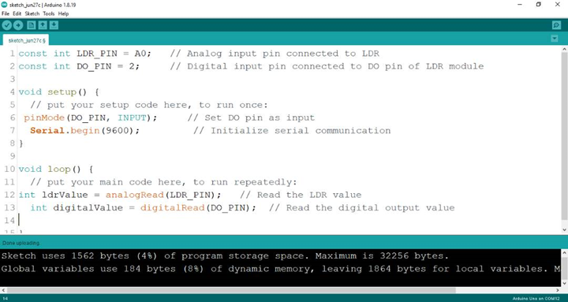.

**Step 8:** Type ``` Serial.print(“Analog Value:”); ``` as shown below in the image.

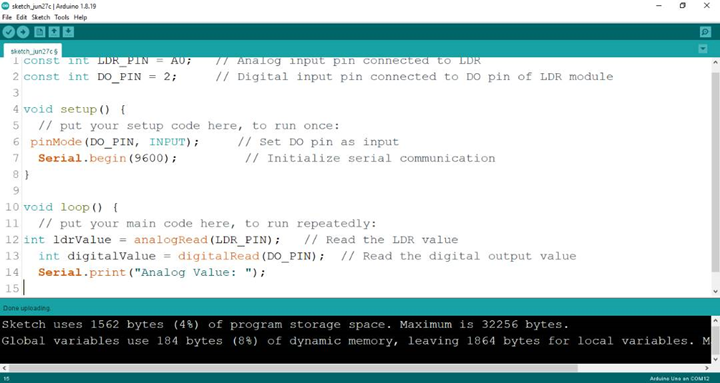.

**Step 9:** Type ``` Serial.printIn(ldrValue); ``` as shown below in the image.

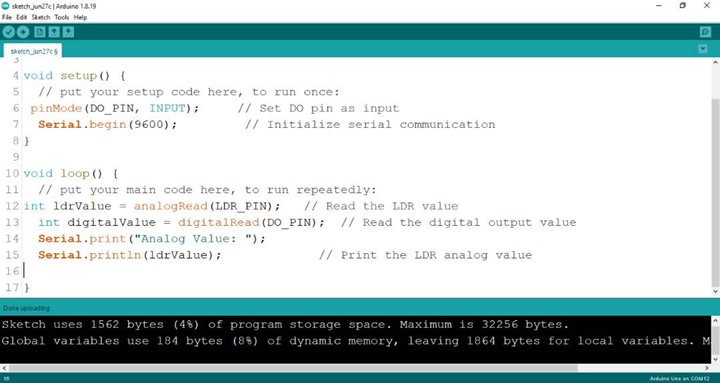.

**Step 10:** Type ``` Serial.print(“Digital Value:”); ``` as shown below in the image.

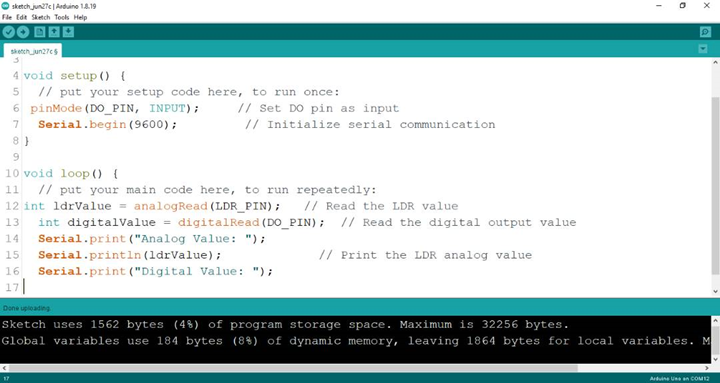.

**Step 11:** Type ``` Serial.printIn(digitalValue); ``` as shown below in the image.

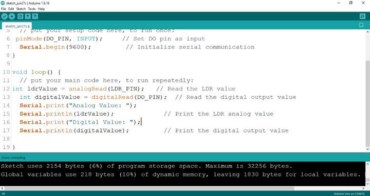.


**Step 12:** Save your code. _See the [Getting Started](../../../../README.md#getting-started) section_

**Step 13:** Select the arduino board and port _See the [Getting Started](../../../../README.md#getting-started) section:Selecting Arduino Board Type and Uploading your code_.

**Step 14:** Upload your code.

## CONCLUSION
In summary, this LED project presents a basic yet significant step in understanding parallel LED control. By simultaneously lighting up two LEDs, learners gain insight into simple circuit connections and programming synchronization. This project serves as a starting point for more complex configurations while highlighting the fundamental principle of coordinated electronic actions, setting the stage for broader exploration in electronics and automation.


