# Project 14: TWIN LIGHT

| **Description** | Twin Light is an engaging Arduino project that demonstrates dual LED control through a push-button interface. Pressing the (one) button activates two LEDs, and releasing the button turns off the LEDs at the same time. |
|------------------|----------------------------------------------------------------|
| **Use case**     | Twin Light can be applied as a personalized entryway indicator. Mount one LED outside and another inside a room. Pressing the button by the door lights up the external LED, signaling someone's presence. Releasing the button turns off the LED. Simultaneously, the internal LED mirrors the behavior, enabling those inside to confirm someone's arrival. This project showcases a creative way to communicate events through a simple user interaction. |

## Components (Things You will need)

|  |  |  |  |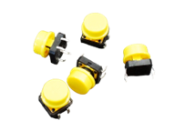 |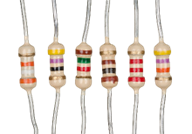 |
|-------------------------|-------------------------|-------------------------|-------------------------|-------------------------|-------------------------|

## Building the circuit

Things Needed:

-   Arduino Uno = 1
-	Arduino USB cable = 1
-	Resistor = 1
-	Push button = 1
-	Red LED = 1
-	Red jumper wires = 1
-	Black jumper wires = 1
-	Yellow jumper wires = 1
-	Blue jumper wires = 1


## Mounting the component on the breadboard

Push Button = 1

Before we start the project let's understand the terminals of the LED and how it is being connected.

**Step 1:** Connect the Pushbutton on the breadboard but make sure the two pairs of the pins are connected on each side of the bridge.

.


**Step 2:** Inset two (2) LEDs on the breadboard as shown in the picture below.

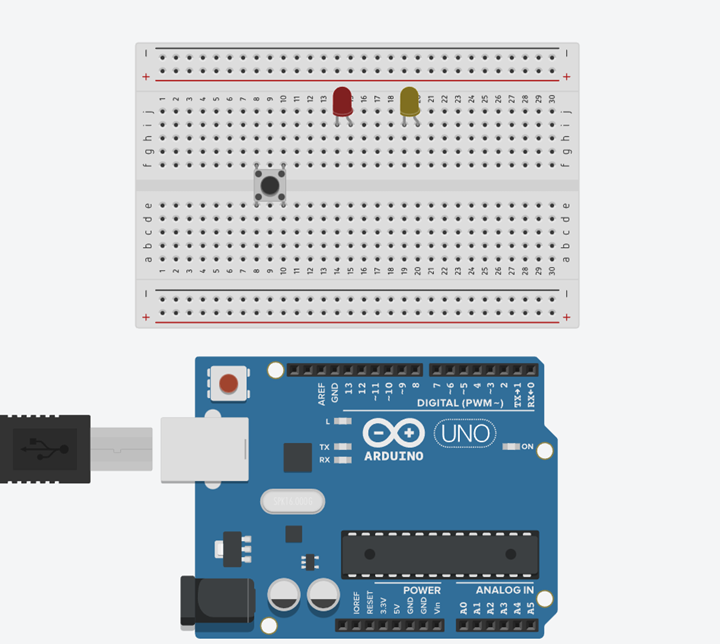.


## WIRING THE CIRCUIT

### Things Needed:

- Red male-male-to-male jumper wires = 1
- Black male-to-male jumper wires = 1
- Yellow male-to-male jumper wires = 1
- Blue male-to-male jumper wires = 1
- White male-to-male jumper wires = 1
- Green male-to-male jumper wires = 1

**Step 3:** Connect the Yellow male-to-male jumper wire from one Pin of the Push Button as a negative to power GND (Ground) on the Arduino UNO.

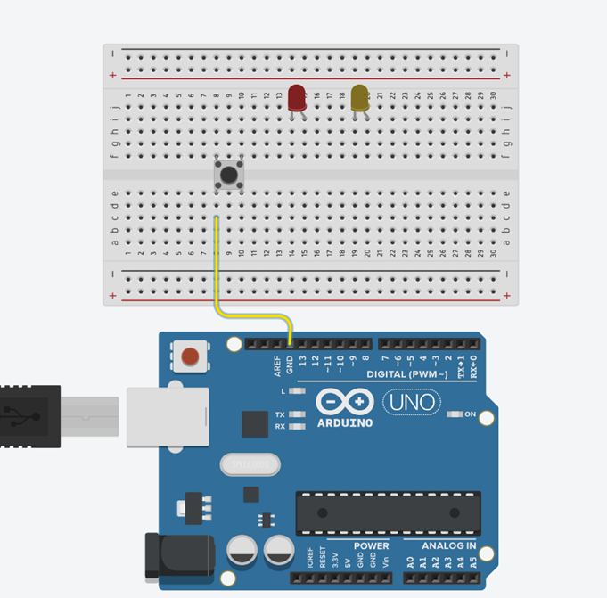

**Step 4:** Connect the Blue male-to-male jumper wire from the other Pin of the push button (not connected to GND) to any digital pin on the Arduino UNO. In this tutorial, we will use digital pin 13.

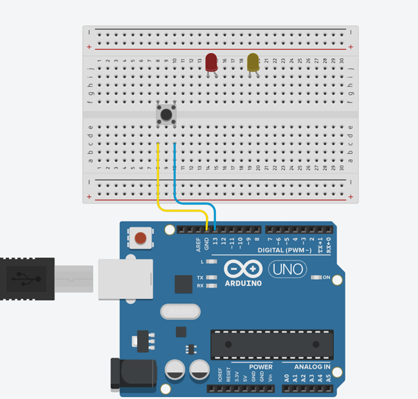

**Step 5:** Connect Black male-to-male jumper wire from the shorter pin of the first LED as a negative to power GND (Ground) on the Arduino UNO.

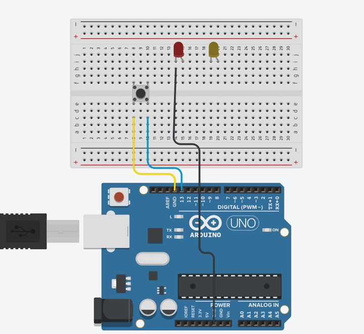

**Step 6:** Connect Red male-to-male jumper wire from the longer pin of the first LED as a positive to digital pin 9 on the Arduino UNO.

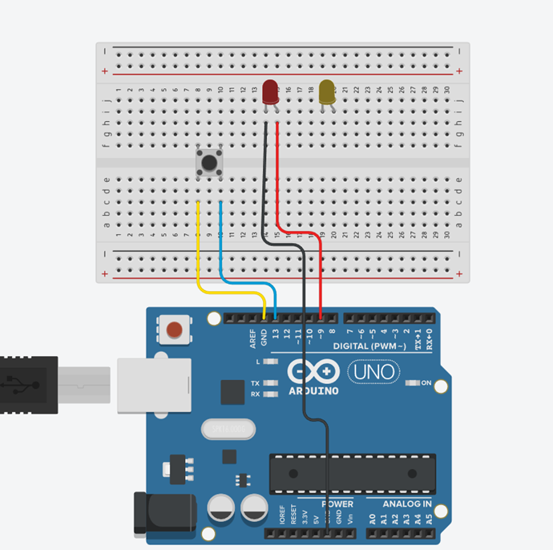

**Step 7:** Connect White male-to-male jumper wire from the shorter pin of the second LED as a negative to power GND (Ground) on the Arduino UNO.

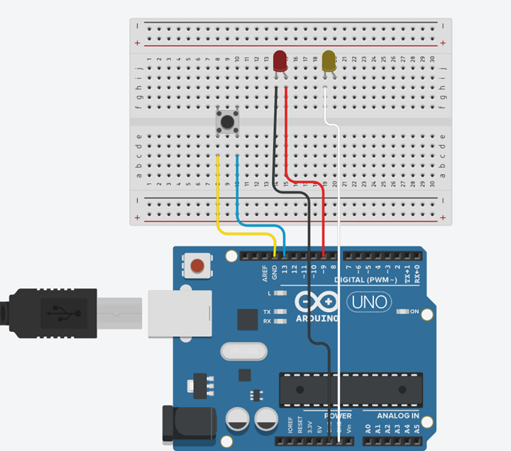

**Step 8:** Connect Green male-to-male jumper wire from the longer pin of the second LED as a positive to digital pin 7 on the Arduino UNO.

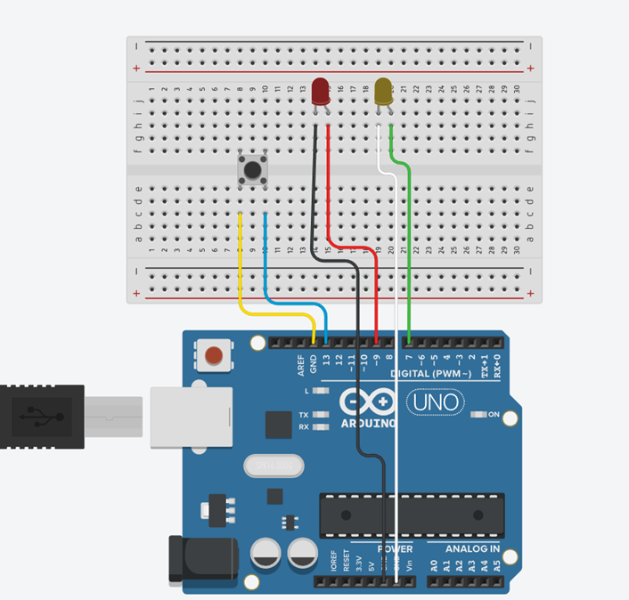

_Make sure to connect the Arduino USB blue cable to the Arduino board_.


## PROGRAMMING

**Step 1:** Open your Arduino IDE. See how to set up here: [Getting Started](../../../../README.md#getting-started).

**Step 2:** Type ``` int ledPin1 = 9;``` as shown in the picture below.

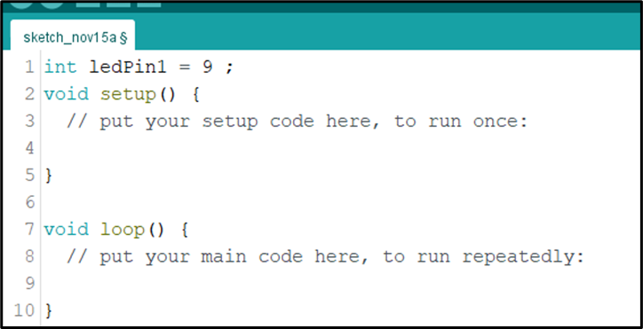.

**Step 3:** Type ``` const int LedPin2 = 7;``` as shown in the picture below.

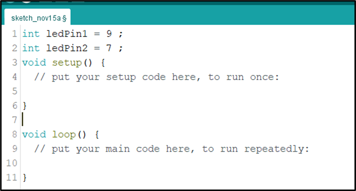.

**Step 4:** Type ``` int buttonPin = 13;``` as shown in the picture below.

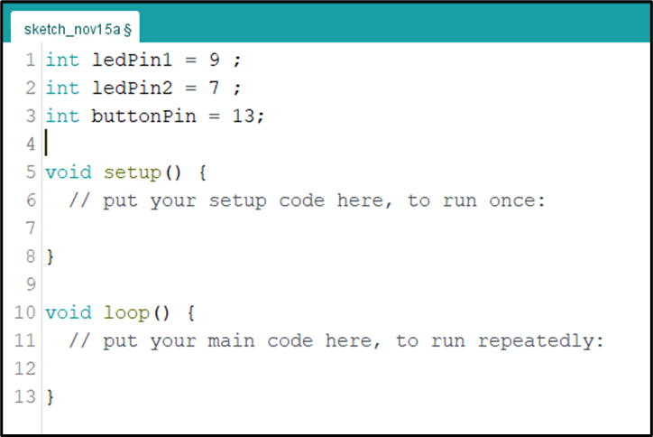.

**Step 5:** Type ``` int buttonState = 0;``` as shown in the picture below.

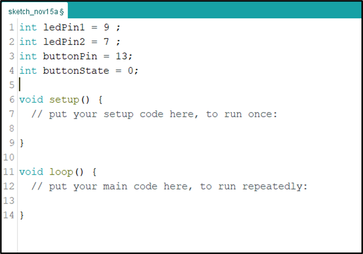.

**Step 6:** Inside the (void setup()) function, type ``` pinMode (ledPin1, OUTPUT);``` as shown in the picture below.

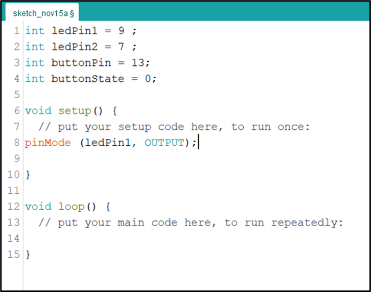.

**NB:** pinMode will help the Arduino board to decide which port should be activated.

**Step 7:** Inside the (void setup()) Type ``` pinMode (ledPin2, OUTPUT);``` as shown in the picture below.

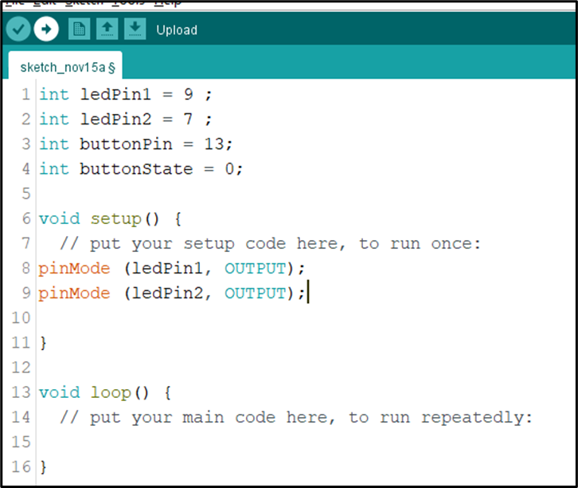.

**Step 8:** Type ``` pinMode (buttonPin, INPUT_PULLUP);``` as shown in the picture below.

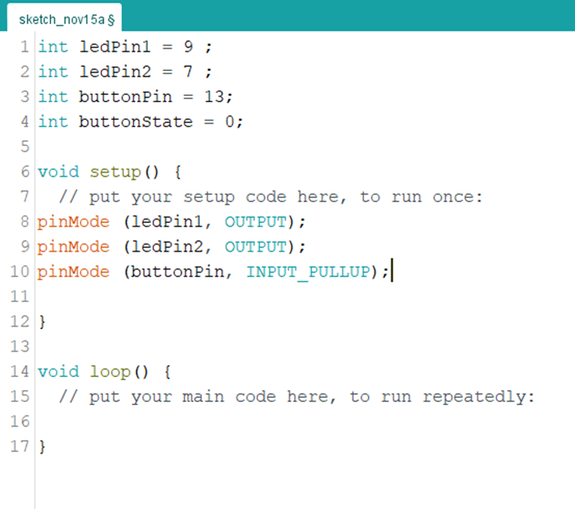.

**Step 9:** Scroll down and click inside the void loop() function  and Type ``` buttonState = digitalRead (buttonPin);``` as shown in the picture below.

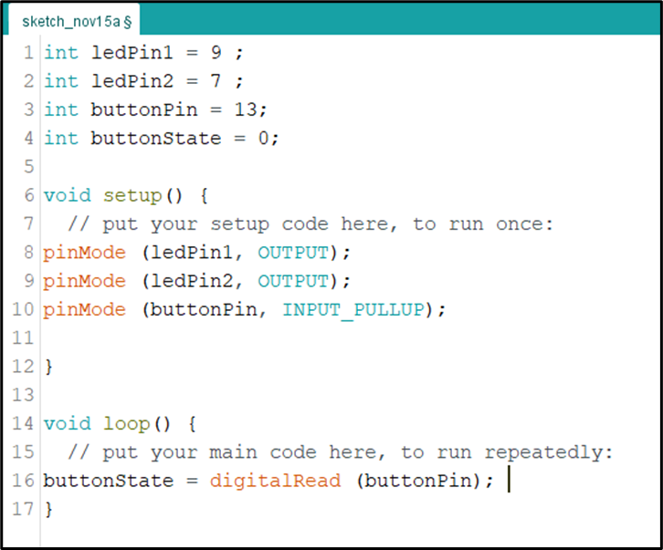.

**Step 10:** Type this conditional statement ``` if (buttonState == LOW) { digitalWrite (LedPin1, HIGH); digitalWrite (ledPin2, HIGH); } ``` as shown in the picture below.

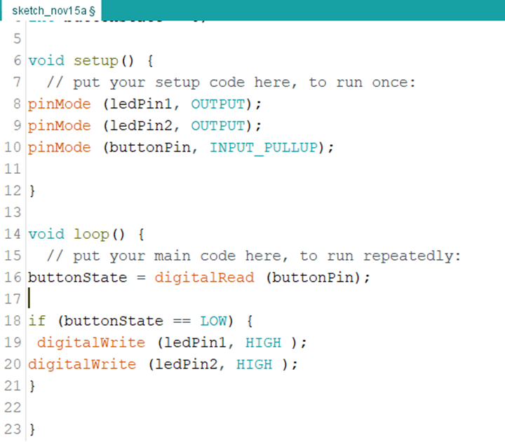.

**Step 11:** Type ``` else { digitalWrite (LedPin1, LOW); digitalWrite (ledPin2, LOW); } ``` as shown in the picture below.

.


## CONCLUSION
To sum up, the one LED blink project demonstrates a foundational concept in electronics and programming. Through this simple yet illuminating endeavor, learners grasp the essentials of hardware interfacing, coding logic, and timing control. This project lays the groundwork for more advanced explorations while showcasing the transformative power of just a single LED, sparking curiosity and creativity in the world of DIY electronics.