# Project 14: TRI-LIGHT

| **Description** | Tri-light is a creative Arduino project that employs a single push button to manage the illumination of three LEDs. Pressing the button cycles through the LEDs, turning each on sequentially, and releasing the button turns off all LEDs. Explore the concept of state management and LED control in this engaging endeavor. |
|------------------|----------------------------------------------------------------|
| **Use case**     | Tri-light can be utilized as an attention-grabbing party decoration. Set up the three LEDs in vibrant colours. When the party starts, guests can press the button to illuminate each LED in a dynamic sequence. Releasing the button turns off all LEDs. This project offers an entertaining way to add a touch of interactivity to gatherings and events, captivating participants with colourful light displays. |

## Components (Tools You Will Need)

|  |  |  |  | | |
|-------------------------|-------------------------|-------------------------|-------------------------|-------------------------|-------------------------|

## Building The Circuit

Tools Needed:

-   Arduino Uno = 1
-	Arduino USB cable = 1
-	Resistor = 1
-	Push button = 1
-	Red LED = 1
-	Red jumper wires = 1
-	Black jumper wires = 1
-	Yellow jumper wires = 1
-	Blue jumper wires = 1


## Mounting the component on the breadboard

Push Button = 1

**Step 1:** Connect the pushbutton on the breadboard but make sure the two pairs of the pins are connected on each side of the bridge.

.
LED = 3

**Step 2:** Insert three (3) LEDs on the breadboard as shown in the picture below.

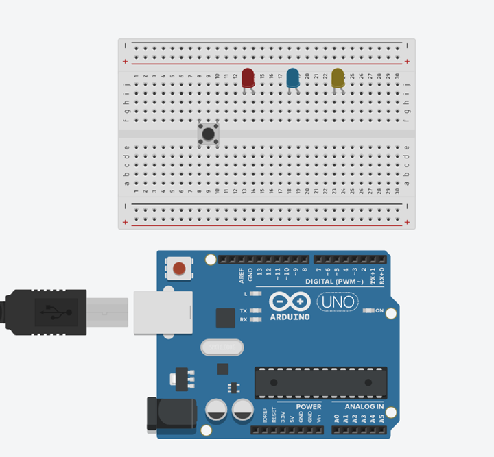.


## WIRING THE CIRCUIT

### Things Needed:

- Red male-male-to-male jumper wires = 1
- Black male-to-male jumper wires = 1
- Yellow male-to-male jumper wires = 1
- Blue male-to-male jumper wires = 1
- White male-to-male jumper wires = 1
- Green male-to-male jumper wires = 1

**Step 1:** Connect male-to-male jumper wire from one Pin of the Push Button as a negative to power GND (Ground) on the Arduino UNO.

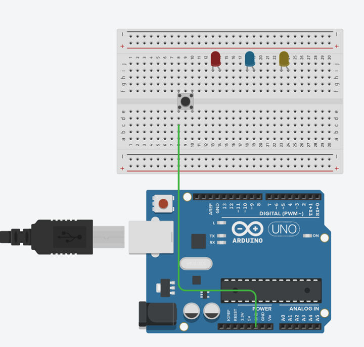

**Step 2:** Connect male-to-male jumper wire from the other Pin of the push button (not connected to GND) to a digital pin 13 on the Arduino UNO. 

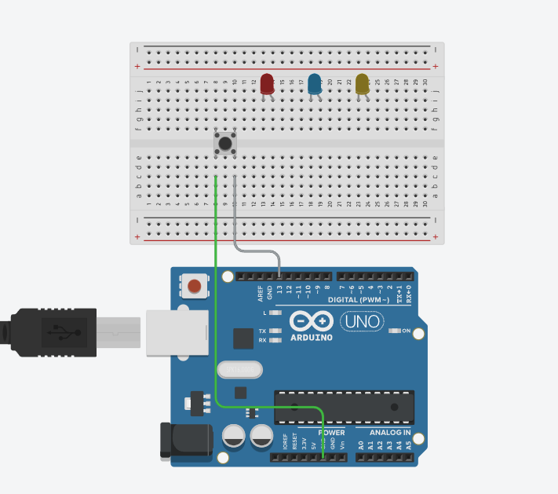

**Step 3:** Connect male-to-male jumper wire from the Arduino GND to one of the negative holes on the breadboard.

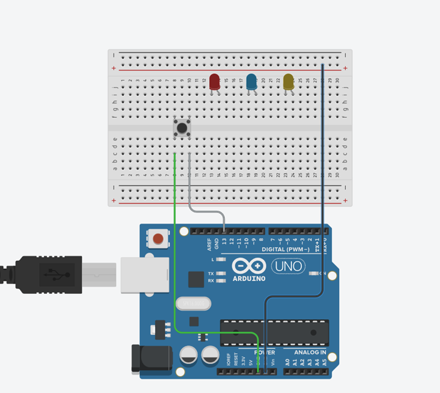

**Step 4:** Connect three male-to-male jumper wires from each of the LEDs negative pins to the negative holes on the breadboard.

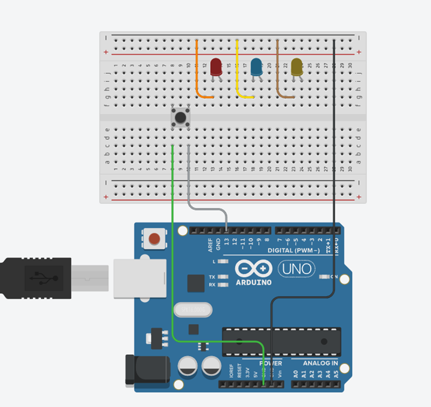

**Step 5:** Connect male-to-male jumper wire from the longer pin of the first LED as a positive to digital pin 12 on the Arduino UNO.


**Step 6:** Connect male-to-male jumper wire from the longer pin of the second LED as a positive to digital pin 9 on the Arduino UNO.

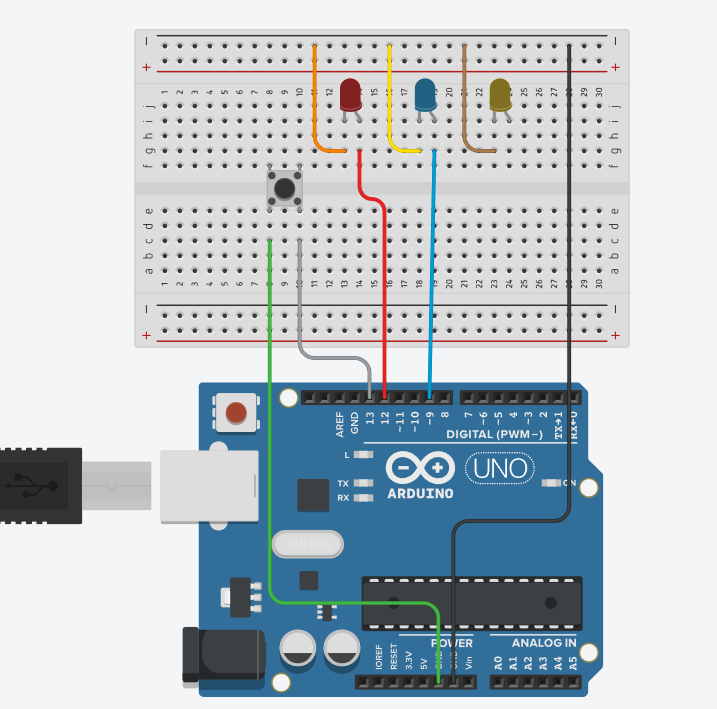

**Step 7:** Connect male-to-male jumper wire from the longer pin of the third LED as a positive to digital pin 4 on the Arduino UNO.

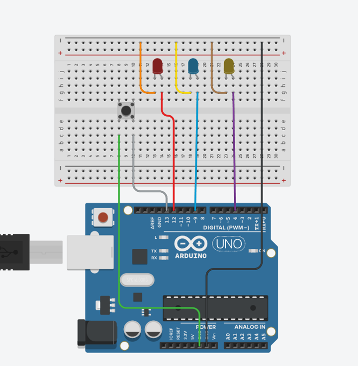

_Make sure to connect the Arduino USB blue cable to the Arduino board_.


## PROGRAMMING

**Step 1:** Open your Arduino IDE. See how to set up here: [Getting Started](../../../../README.md#getting-started).

**Step 2:** Type ``` const int ledPin1 = 12;``` as shown in the picture below.

.

**Step 3:** Type ``` const int ledPin2 = 9;``` as shown in the picture below.

.

**Step 4:** Type ``` const int ledPin3 = 4;``` as shown in the picture below.

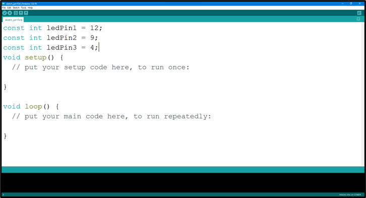.

**Step 5:** Type ``` const int buttonPin = 13;``` as shown in the picture below.

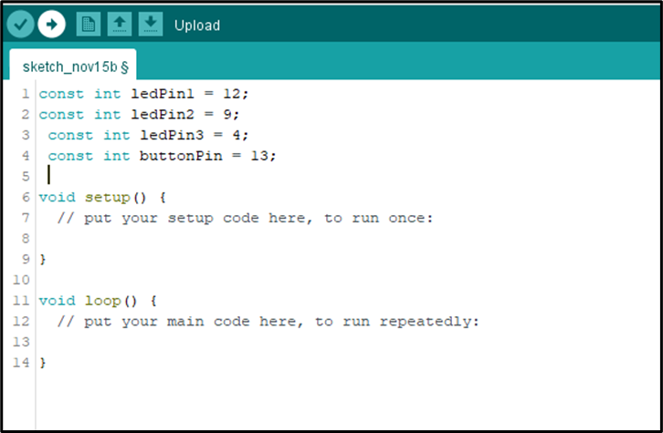.

**Step 6:** Type ``` int buttonState = 0;``` as shown in the picture below.

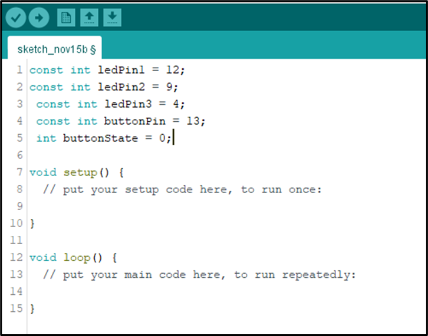.

**Step 7:** Inside the (void setup()), Type 
    ``` 
    pinMode (ledPin1, OUTPUT);
    pinMode (ledPin2, OUTPUT);
    pinMode (ledPin3, OUTPUT);
    pinMode (buttonPin INPUT_PULLUP) ;
    ``` 
  as shown in the picture below.

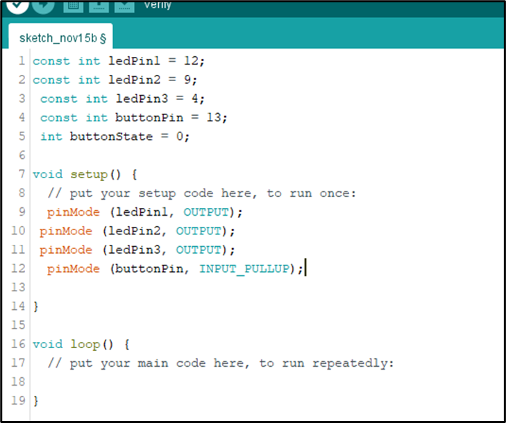.

**NB:** pinMode will help the Arduino board to decide which port should be activated. 

**Step 8:** Type ``` buttonState = digitalRead (buttonPin); ``` as shown in the picture below.

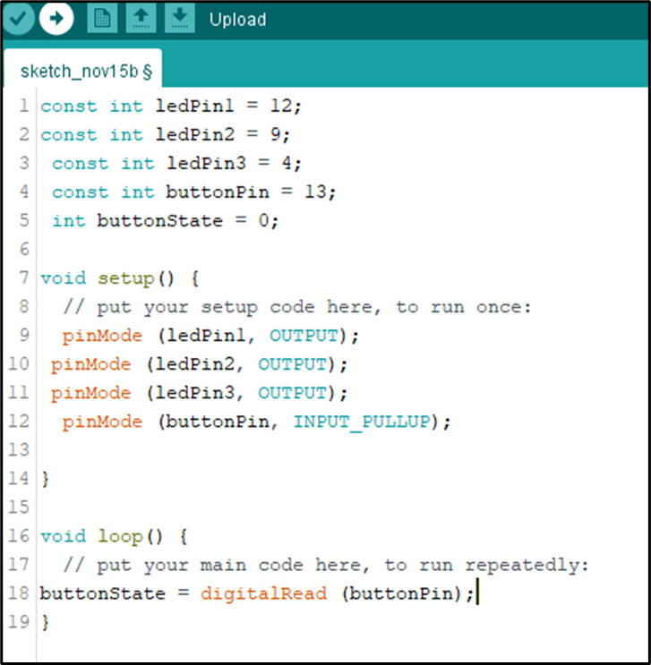.

**Step 9:** Type 
    ``` if (buttonState == LOW)
{    digitalWrite (ledPin1,  HIGH) ;
     digitalWrite (ledPin2, HIGH);
     digitalWrite (ledPin3, HIGH);
     digitalWrite (ledPin3, HIGH); }
    ``` 
  as shown in the picture below.

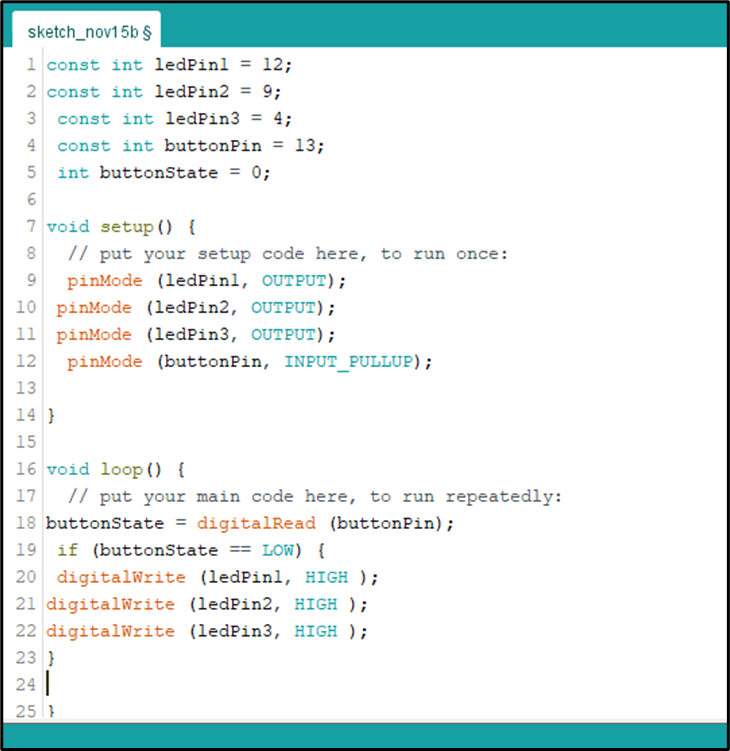.

**Step 10:** Type 
    ``` else {  digitalWrite (ledPin1,  LOW) ;
     digitalWrite (ledPin2, LOW);
     digitalWrite (ledPin3, LOW);
     digitalWrite (ledPin3, HIGH); } ``` 
  as shown in the picture below.

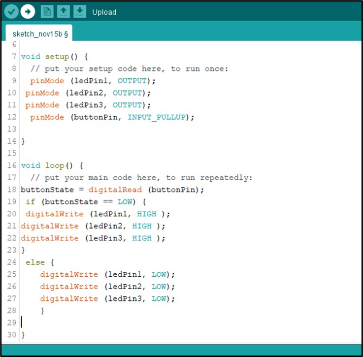.

## CONCLUSION
To sum up, the one LED blink project demonstrates a foundational concept in electronics and programming. Through this simple yet illuminating endeavor, learners grasp the essentials of hardware interfacing, coding logic, and timing control. This project lays the groundwork for more advanced explorations while showcasing the transformative power of just a single LED, sparking curiosity and creativity in the world of DIY electronics.