# Project 13: MANUAL DANCING LIGHT

| **Description** | This is an intriguing Arduino project that demonstrates the control of four LEDs using just one push button. Pressing the button cycles through the LEDs, activating them in sequence, and releasing the button turns off all LEDs. Dive into the world of multi-LED control and button interaction in this captivating experiment. |
|------------------|----------------------------------------------------------------|
| **Use case**     | This can be applied as an innovative room ambiance enhancer. Place the four LEDs strategically around the room, each emitting a different hue. Guests can press the button to cycle through the LEDs, creating varying atmospheres to match different occasions or moods. Releasing the button turns off all LEDs, allowing for seamless transitions between lighting settings. This project showcases a creative way to transform a space with just a single button press. |

## Components (Tools You Will Need)

|  |  |  |  | | |
|-------------------------|-------------------------|-------------------------|-------------------------|-------------------------|-------------------------|

## Building The Circuit

Tools Needed:

-   Arduino Uno = 1
-	Arduino USB cable = 1
-	Resistor = 1
-	Push button = 1
-	Red LED = 1
-	Red jumper wires = 1
-	Black jumper wires = 1
-	Yellow jumper wires = 1
-	Blue jumper wires = 1


## Mounting the component on the breadboard

Push Button = 1

**Step 1:** Connect the pushbutton on the breadboard but make sure the two pairs of the pins are connected on each side of the bridge.

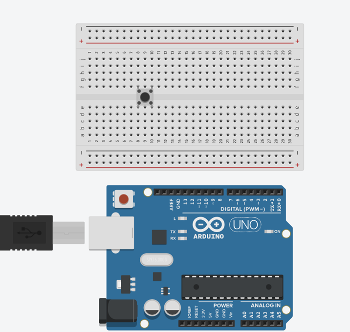.

LED = 4

**Step 2:** Insert four (4) LEDs on the breadboard as shown in the picture below.

.


## WIRING THE CIRCUIT

### Things Needed:

- Red male-male-to-male jumper wires = 1
- Black male-to-male jumper wires = 1
- Yellow male-to-male jumper wires = 1
- Blue male-to-male jumper wires = 1
- White male-to-male jumper wires = 1
- Green male-to-male jumper wires = 1

**Step 1:** Connect male-to-male jumper wire from one Pin of the Push Button as a negative to power GND (Ground) on the Arduino UNO.

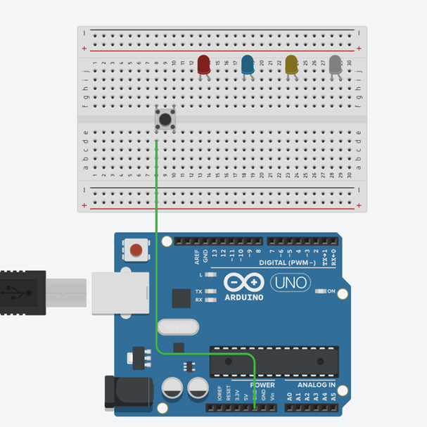.

**Step 2:** Connect male-to-male jumper wire from the other Pin of the push button (not connected to GND) to a digital pin 13 on the Arduino UNO. 

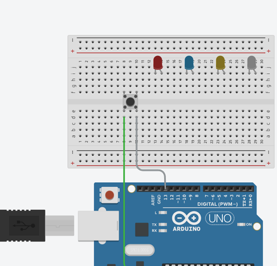.

**Step 3:** Connect three male-to-male jumper wires from each of the LEDs negative pins to the negative holes on the breadboard.

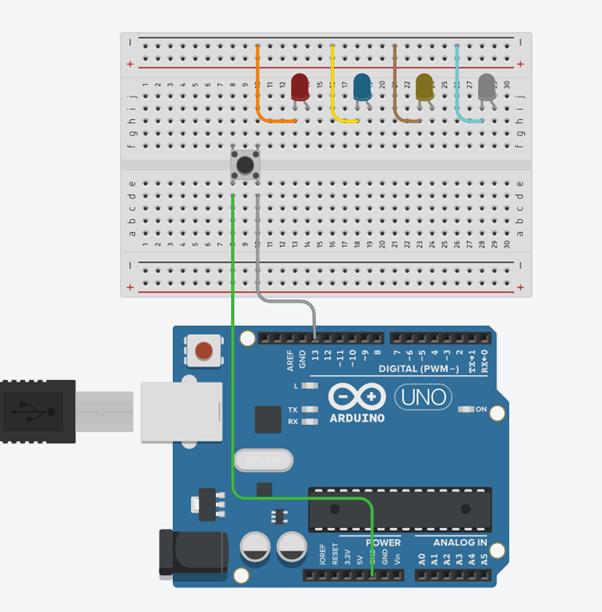.

**Step 4:** Connect male-to-male jumper wire from the longer pin of the first LED as a positive to digital pin 12 on the Arduino UNO.

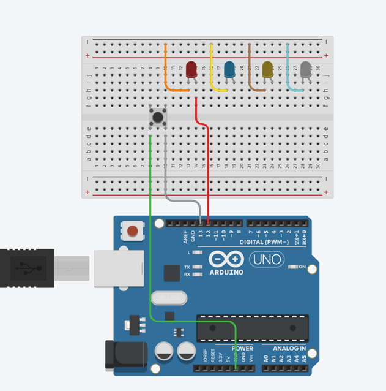.

**Step 5:** Connect male-to-male jumper wire from the longer pin of the second LED as a positive to digital pin 9 on the Arduino UNO.

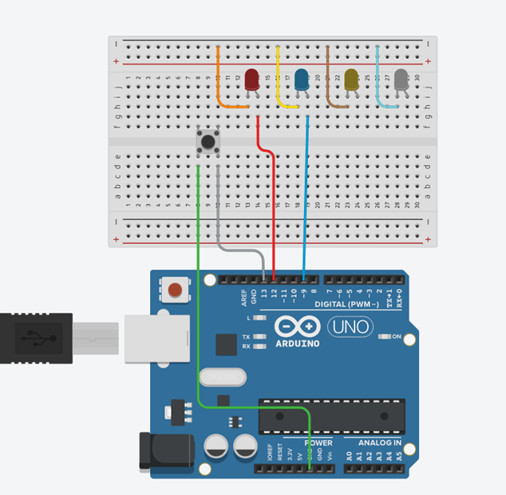.

**Step 6:** Connect male-to-male jumper wire from the longer pin of the third LED as a positive to digital pin 4 on the Arduino UNO.

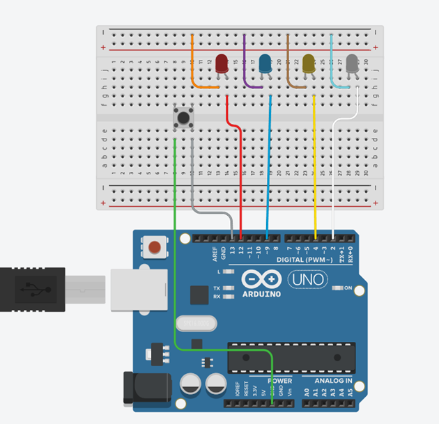.

**Step 7:** Connect male-to-male jumper wire from the longer pin of the third LED as a positive to digital pin 2 on the Arduino UNO.

.

**Step 8:** Connect male-to-male jumper wire from the Arduino GND to one of the negative holes on the breadboard.

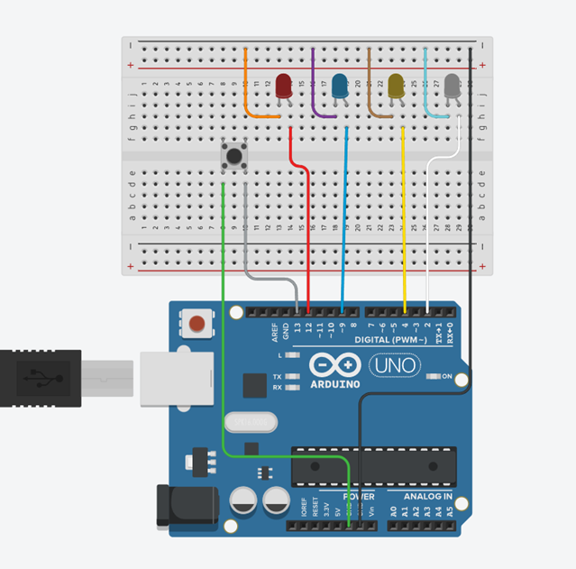.

_Make sure to connect the Arduino USB Blue cable to the Arduino board_.


## PROGRAMMING

**Step 1:** Open your Arduino IDE. See how to set up here: [Getting Started](../../../../README.md#getting-started).

**Step 2:** Type ``` const int ledPin1 = 12;``` as shown in the picture below.

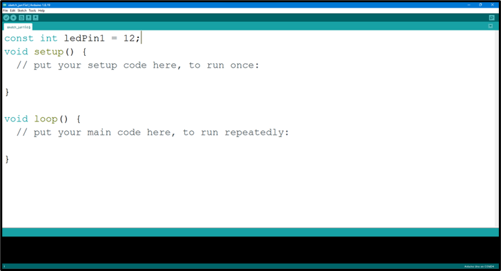.

**Step 3:** Type ``` const int ledPin2 = 9;``` as shown in the picture below.

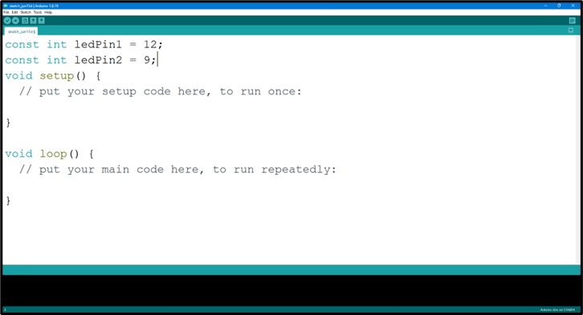.

**Step 4:** Type ``` const int ledPin3 = 4;``` as shown in the picture below.

.

**Step 5:** Type ``` const int ledPin4 = 2;``` as shown in the picture below.

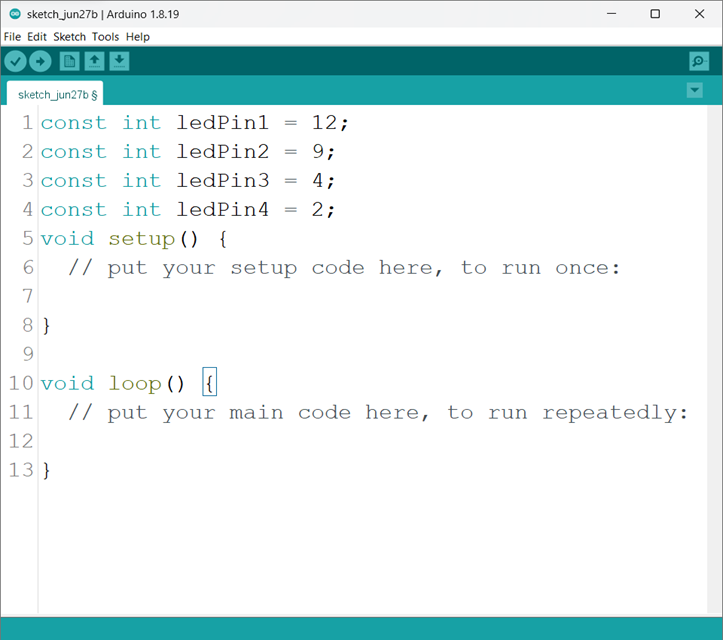.

**Step 6:** Type ``` const int buttonPin = 13;``` as shown in the picture below.

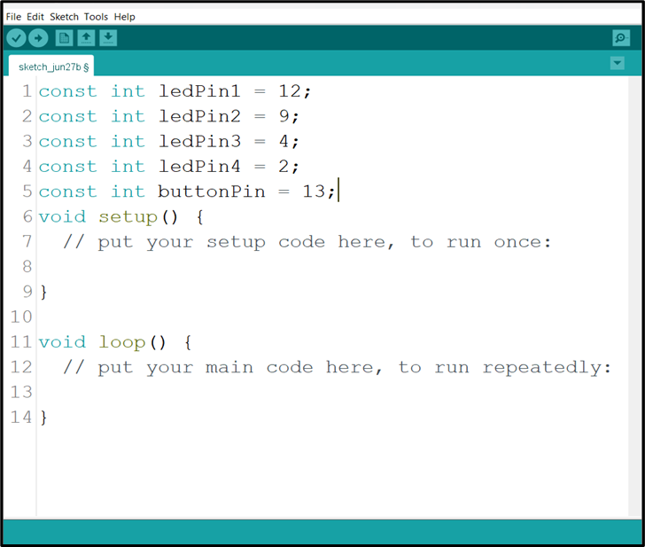.

**Step 7:** Type ``` bool isBlinking = false ;``` as shown in the picture below.

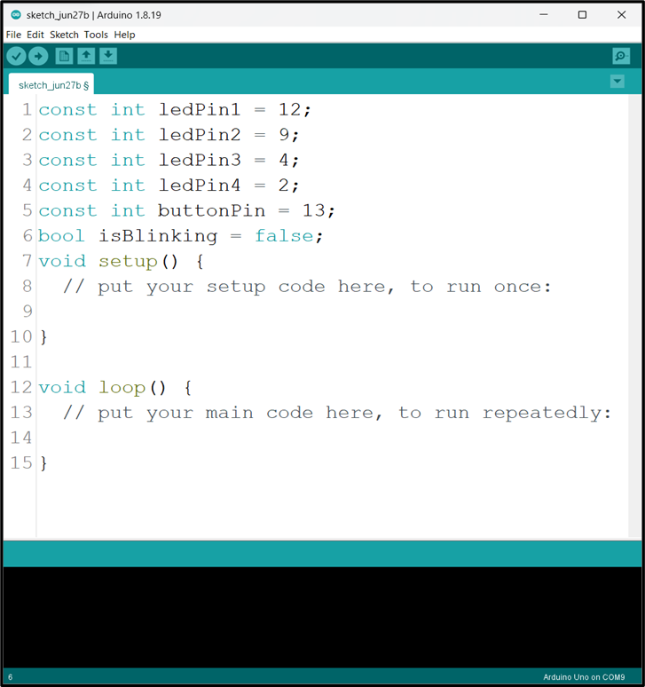.

**Step 8:** Inside the (void setup()), Type 
    ``` pinMode (ledPin,  OUTPUT);
        pinMOde (ledPin,OUTPUT)
        pinMode (ledPin3, OUTPUT); 
        pinMode (ledPin4, OUTPUT);  
    ``` 
  as shown in the picture below.

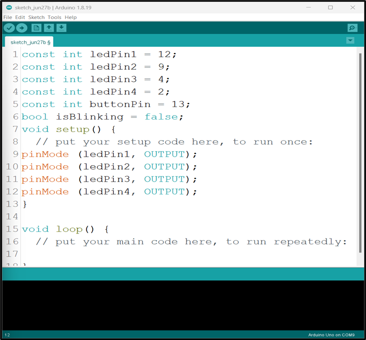.

**Step 9:** Type ``` pinMode (buttonPin, INPUT_PULLUP) ;``` as shown in the picture below.

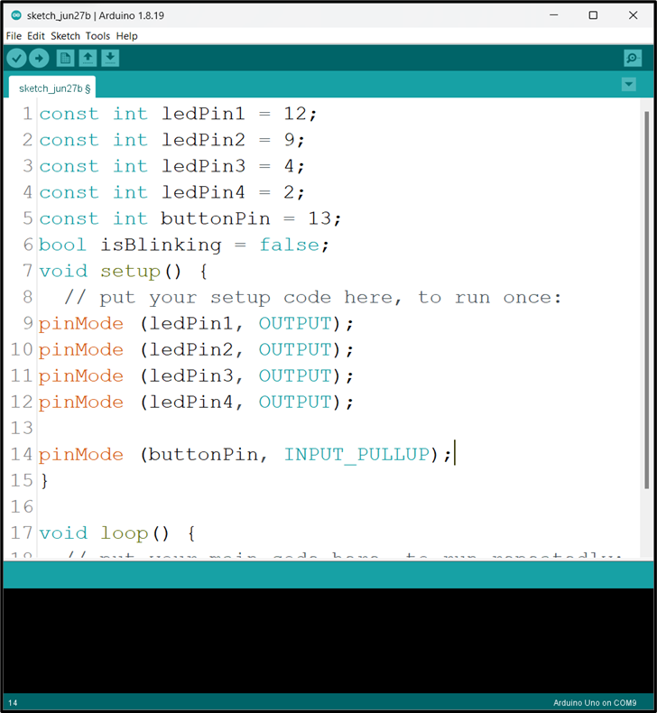.

**Step 10:** Scroll down and click inside the void loop() and Type ``` if (digitalRead(buttonPin) == LOW && !isBlinking) { ;``` as shown in the picture below.

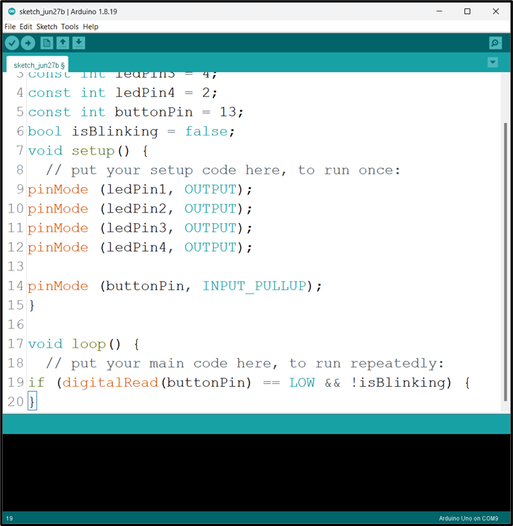.

**Step 11:**  Type ``` isBlinking = true ;``` as shown in the picture below.

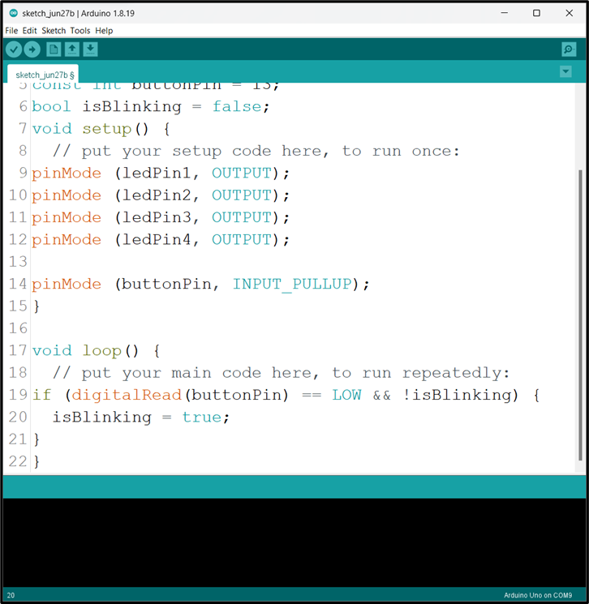.

**Step 12:**  Type ```  while(digitalRead(buttonPin) == LOW) {
      digitalWrite (ledPin1, HIGH);
      digitalWrite (ledPin2, HIGH);
      digitalWrite (ledPin3, HIGH);
      digitalWrite (ledPin4, HIGH);
      delay (500) ;
}``` 
as shown in the picture below.

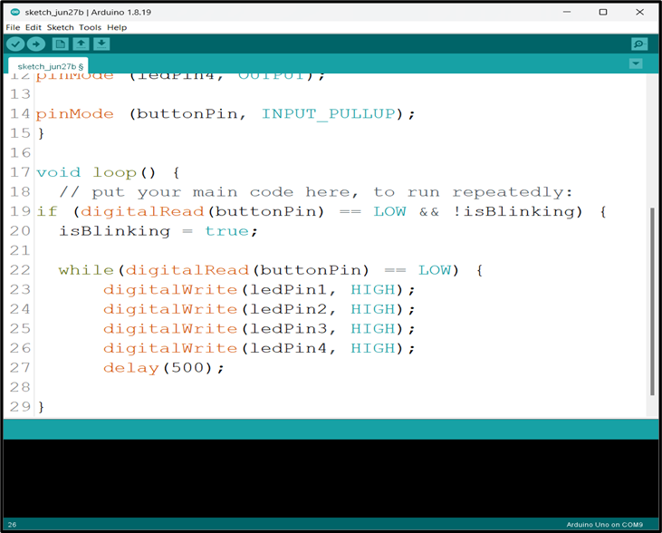.

**Step 13:**  Type 
```  
digitalWrite (ledPin1, LOW);	
digitalWrite (ledPin2, LOW);
digitalWrite (ledPin3, LOW);
digitalWrite (ledPin4, LOW);
delay (500); 
``` 
as shown in the picture below.

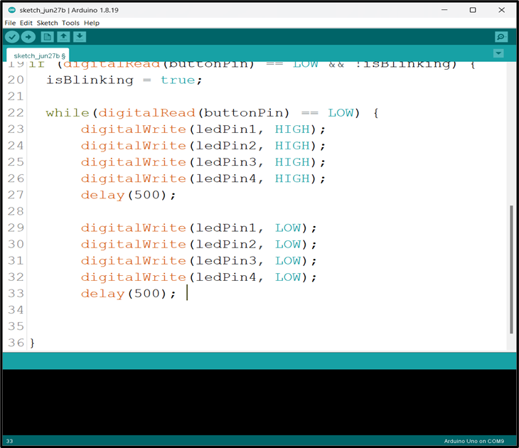.

**Step 14:**  Type ``` isBlinking = false ;``` as shown in the picture below.

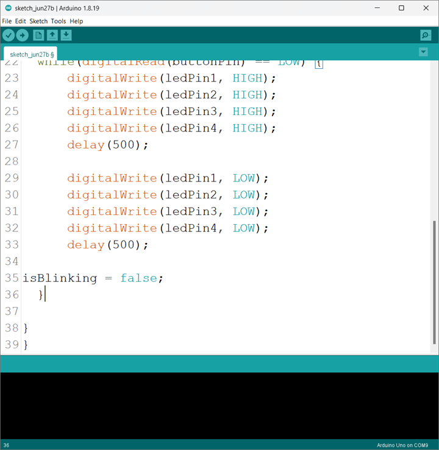.


## CONCLUSION
To sum up, the one LED blink project demonstrates a foundational concept in electronics and programming. Through this simple yet illuminating endeavor, learners grasp the essentials of hardware interfacing, coding logic, and timing control. This project lays the groundwork for more advanced explorations while showcasing the transformative power of just a single LED, sparking curiosity and creativity in the world of DIY electronics.