# Project 2: CAR TRAVIGATOR BLINKING

| **Description** | This project demonstrates how to measure distance without a physical ruler, using an ultrasonic sensor to detect and display distances. This system can be adapted for a variety of applications, such as object detection, intruder alerts, or automated measurement systems. |
|------------------|----------------------------------------------------------------|
| **Use case**     | If you want to measure the distance between two objects or perhaps create a smart system that can detect intruders, you can easily do that by using the approach in these lessons. |

## Components (Things You will need)

|  |  |  |  ||
|-------------------------|-------------------------|-------------------------|-------------------------|-------------------------|

## Building the circuit

Things Needed:

-	Arduino Uno Board = 1
-	Arduino USB cable = 1
-	Breadboard = 1
-   jumper wires = 4
-	Ultrasonic Sensor = 1

## Mounting the component on the breadboard

**Step 1:** Insert the ultrasonic sensor into the vertical connectors of the breadboard with the pins facing outward.

.

_**NB:** Make sure you identify where the positive pin (+) and the negative pin (-) is connected to on the breadboard. The longer pin of the LED is the positive pin and the shorter one, the negative PIN_.

## WIRING THE CIRCUIT

### Things Needed:

- Red male-to-male jumper wire = 1
- Black male-to-male jumper wire = 1
- white male-to-male jumper wire = 1
- Blue male-to-male jumper wire = 1

**Step 2:** Red Wire (VCC): Connect one end to the VCC pin on the ultrasonic sensor and the other end to the 5V pin on the Arduino Uno.

**Step 3:** Black Wire (GND): Connect one end to the GND pin on the ultrasonic sensor and the other end to the GND on the Arduino Uno.

**Step 4:** White Wire (Trig): Connect one end to the Trig pin on the ultrasonic sensor and the other end to Digital Pin 11 on the Arduino Uno.

**Step 5:** Blue Wire (Echo): Connect one end to the Echo pin on the ultrasonic sensor and the other end to Digital Pin 12 on the Arduino Uno.

## PROGRAMMING

**Step 1:** Open your Arduino IDE. See how to set up here: [Getting Started](../../../../README.md#getting-started).

**Step 2:** Define Variables:
•	Set up pins for the Trig and Echo, and declare distance and duration as follows:
int Trig = 11;
int Echo = 12;
int distance;
int duration;

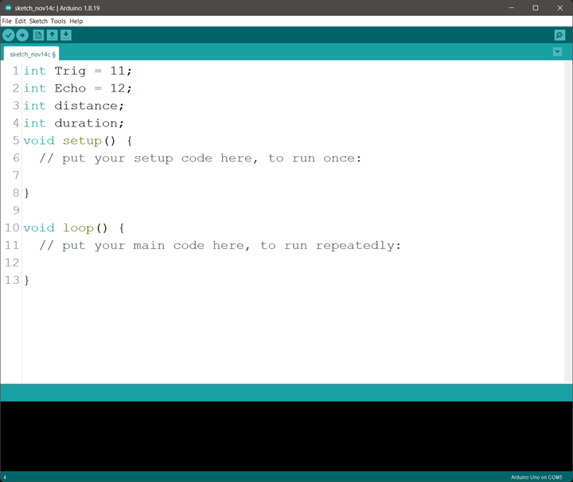.

**Step 3:** Configure Pin Modes in void setup():
void setup() {
    pinMode(Trig, OUTPUT);
    pinMode(Echo, INPUT);
    Serial.begin(9600); 
}

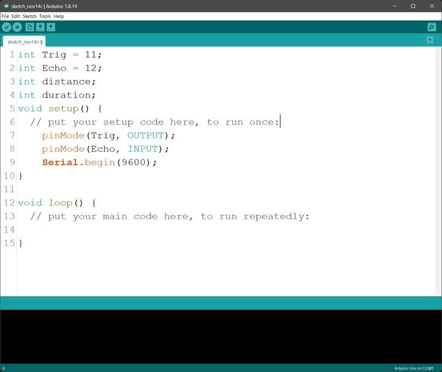.

**Step 4:** Measure Distance in void loop():
void loop() {
    digitalWrite(Trig, LOW);
    delayMicroseconds(2);
    digitalWrite(Trig, HIGH);
    delayMicroseconds (10);
    digitalWrite(Trig, LOW);

    duration = pulseIn(Echo, HIGH); // Receives the echo signal
    distance = duration * 0.034 / 2; // Calculate distance

    Serial.print(distance); // Print the distance
    Serial.println(" cm");
    delay(100);
}
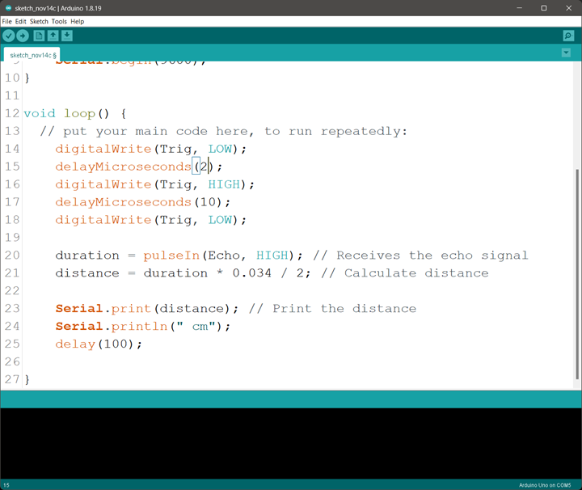.

**Step 5:** Select the arduino board and port _See the [Getting Started](../../../../README.md#getting-started) section:Selecting Arduino Board Type and Uploading your code_.

## UPLOADING THE CODE
Step 1:  connect the Arduino USB cable to the Arduino Uno and the other end to our computer\ laptop.
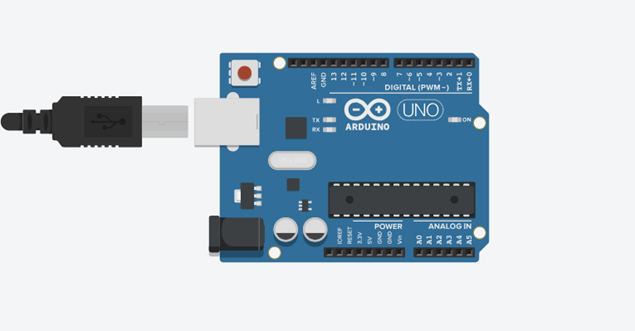.

Step 2: On the Arduino IDE, click on “Tick button “at the top left corner of the Arduino IDE, as shown below to verify your codes.
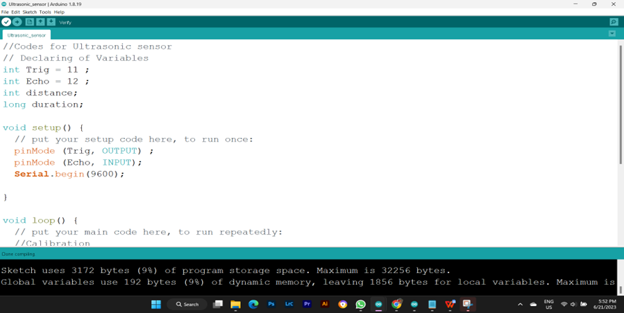.

Step 3: On the Arduino IDE, click on “Tools “at the top left corner of the Arduino IDE, as shown below to pop up a menu.
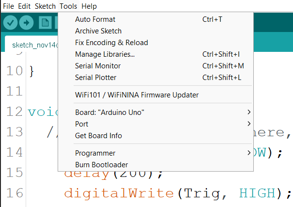.

Step 4: From the pop-up menu, select port and click on the current port there. Again, from the same pop - up menu, click on Board and select Arduino Uno.
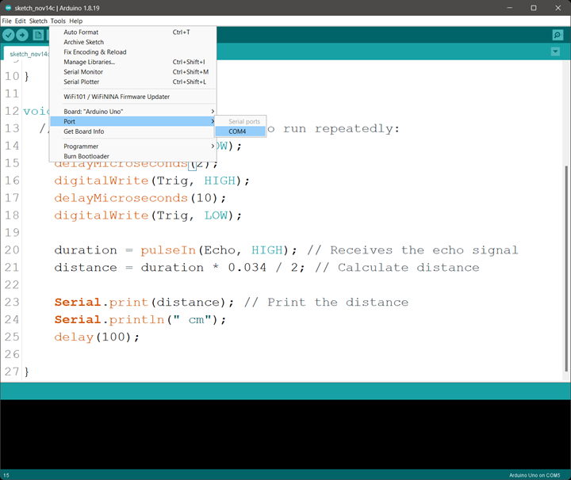.
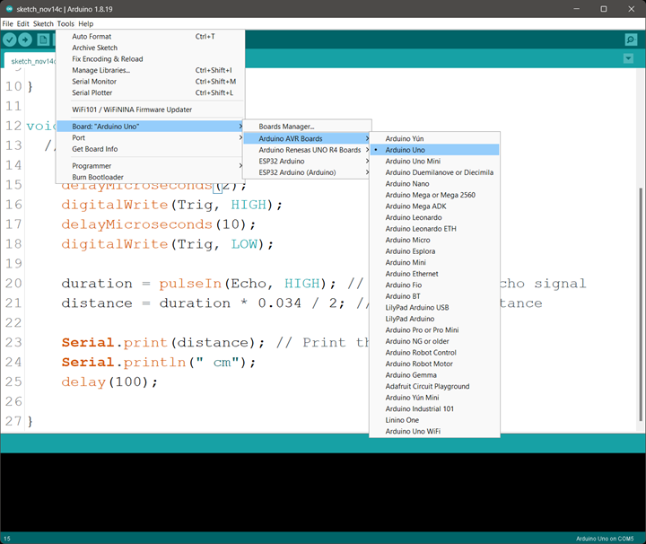.

Step5: Now click on the upload sign to upload our code to the Arduino Uno making it to work as shown in the picture below.
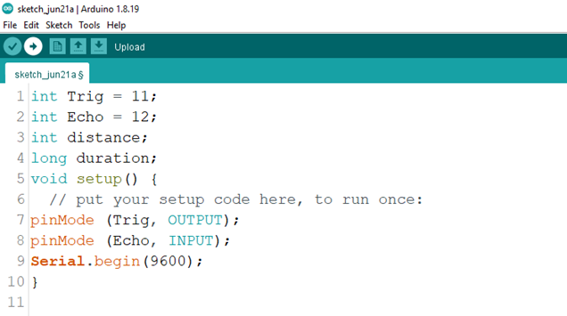.

Step6: Click on the serial monitor icon to view the distances being recorded as shown in the picture below.
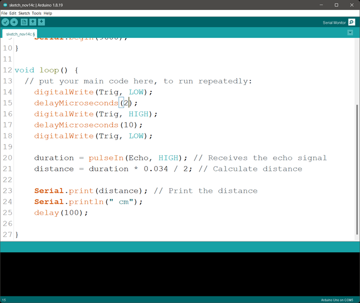.

Step7: Put an object or your hand in front of the ultrasonic sensor and keep moving it away or closer to see the changes in the distances on the serial monitor.
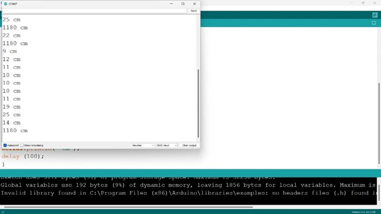.

## CONCLUSION
This project introduces the basics of non-contact distance measurement using an ultrasonic sensor, which is valuable in many applications like robotics, automation, and navigation. By understanding time-of-flight measurements, you gain insights into signal processing and sensor-based systems. 
For further support, visit STEMAIDE or follow us on social media @stemaideafrica. 

## CCopyright
STEMAIDE Africa Ltd.
© 2023 STEMAIDE Africa Ltd. All rights reserved.

STEMAIDE, the STEMAIDE logo are trademarks of STEMAIDE Africa Ltd., registered in Ghana and other countries and regions.

STEMAIDE Africa Ltd.
15th Sun Street
Ring road – Accra

Visit our website on https://www.stemaide.com
Follow us on socials @stemaideafrica
+233 27 768 7772
+233 54 888 9998
